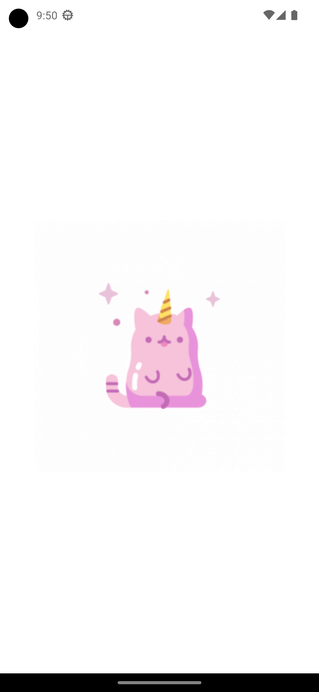

<h1>Wachanga test task</h1>

<h2>Task</h2>

   Создание приложения для демонстрации стилизованных компонентов.
   Необходимо сверстать 3 компонента:
    1. Имеется список из N кнопок, где 1 является активной (выбранной). По нажатию на другую кнопку она становится активной, а остальные переходят в обычное состояние.             Использовать Redux.
    2. Сверстать кнопку, на которой имеется прогресс с возможностью его указать.
    3. Стилизовать TextInput под 4 состояния (Без текста, без фокуса; Без текста, с фокусом; С текстом, без фокуса; С текстом, с фокусом).
    4. Настроить навигацию через react-navigation.
    5. Кастомный splash-screen и иконка приложения.

<h2>Dependencies</h2>
» React JS v.18.2 
» React Redux v.8.0 
» TypeScript v.4.8.4 
» React navigation/native v.6.1.6  

 

  
Screenshots of the Project

  
  
  
  

