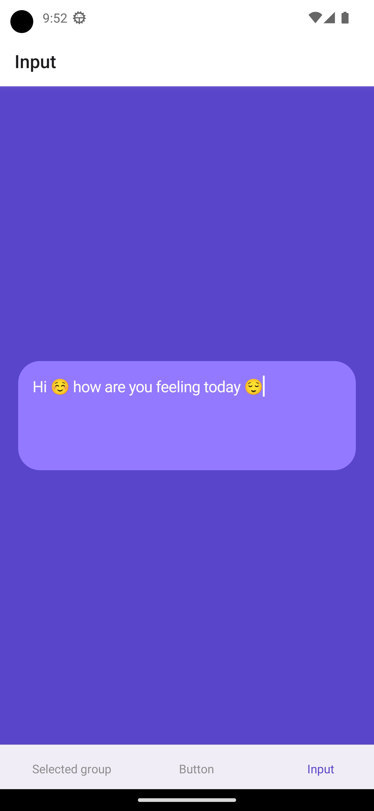

<h2>Wachanga test task</h2>

 

<h2>Screenshots of the Project</h2>
 
<h3 align='center'>App icon</h3>

 
<h3 align='center'>Splash screen</h3>

 
<h3 align='center'>Selected group screen</h3>

 
<h3 align='center'>Button screen</h3>

 
<h3 align='center'>Input screen</h3>

